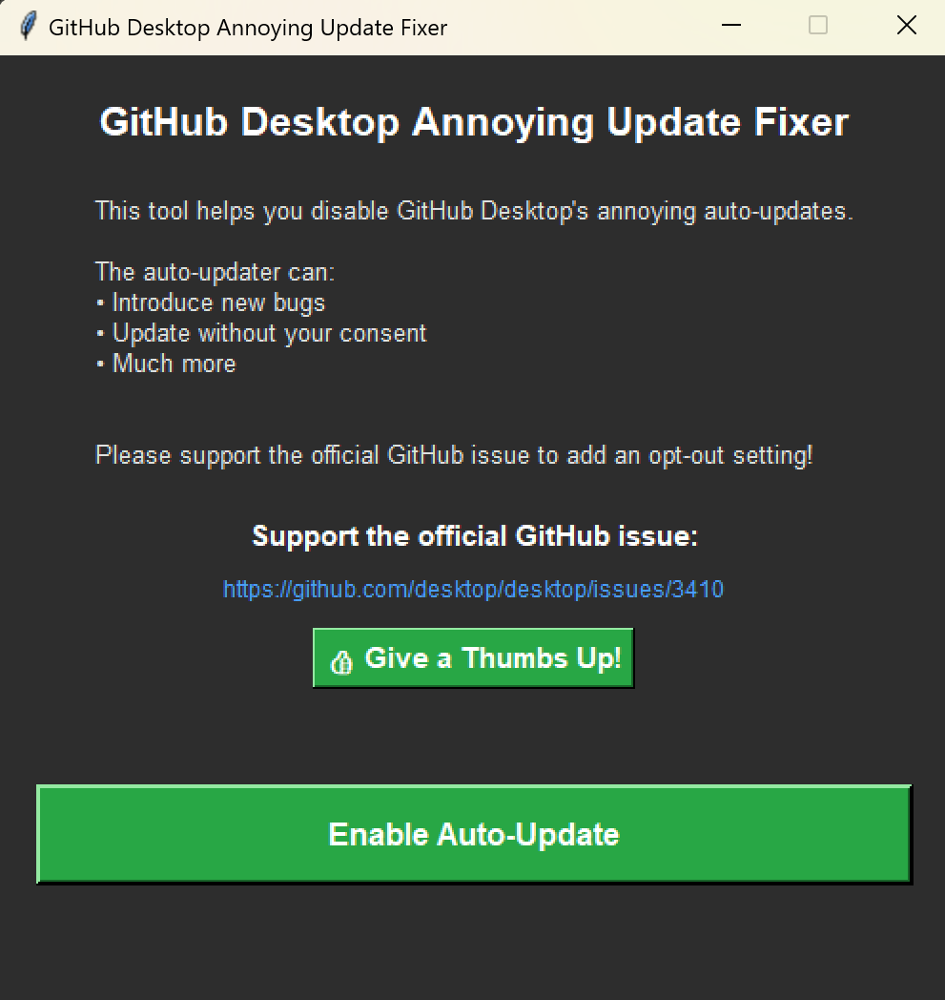

# GitHub Desktop Annoying Update Fixer

A simple GUI tool to disable GitHub Desktop's annoying auto-updates that can introduce bugs without user consent.



## What it does

This tool renames the `Update.exe` file in GitHub Desktop's installation directory to `AnnoyingUpdate.exe`, effectively disabling the auto-update mechanism. The button toggles between enabling and disabling updates.

## Features

- **Simple GUI**: Easy-to-use interface with dark theme
- **Toggle functionality**: Single button to enable/disable updates
- **File existence checks**: Prevents errors when files don't exist
- **Visual feedback**: Button changes color and text based on current state
- **GitHub issue link**: Direct link to support the official feature request

## How to use

1. Run `python app.py`
2. Click the button to toggle GitHub Desktop updates on/off
3. The button will change color and text to show the current state:
   - **Red "Disable Auto-Update"**: Updates are currently enabled
   - **Green "Enable Auto-Update"**: Updates are currently disabled

## Requirements

- Python 3.x
- tkinter (usually included with Python)

## Installation

1. Clone or download this repository
2. Navigate to the project directory
3. Run the application:
   ```bash
   python app.py
   ```

## How it works

The tool targets the GitHub Desktop installation directory at:
```
%LOCALAPPDATA%\GitHubDesktop
```

It renames:
- `Update.exe` → `AnnoyingUpdate.exe` (to disable updates)
- `AnnoyingUpdate.exe` → `Update.exe` (to enable updates)

## Support the official feature

This tool is a workaround for the lack of an official opt-out setting. Please support the official GitHub issue to add this feature:

**[GitHub Desktop Issue #3410](https://github.com/desktop/desktop/issues/3410)**

## Disclaimer

This tool modifies GitHub Desktop's internal files. Use at your own risk. The developers are not responsible for any issues that may arise from using this tool.

## License

This project is open source and available under the MIT License. 